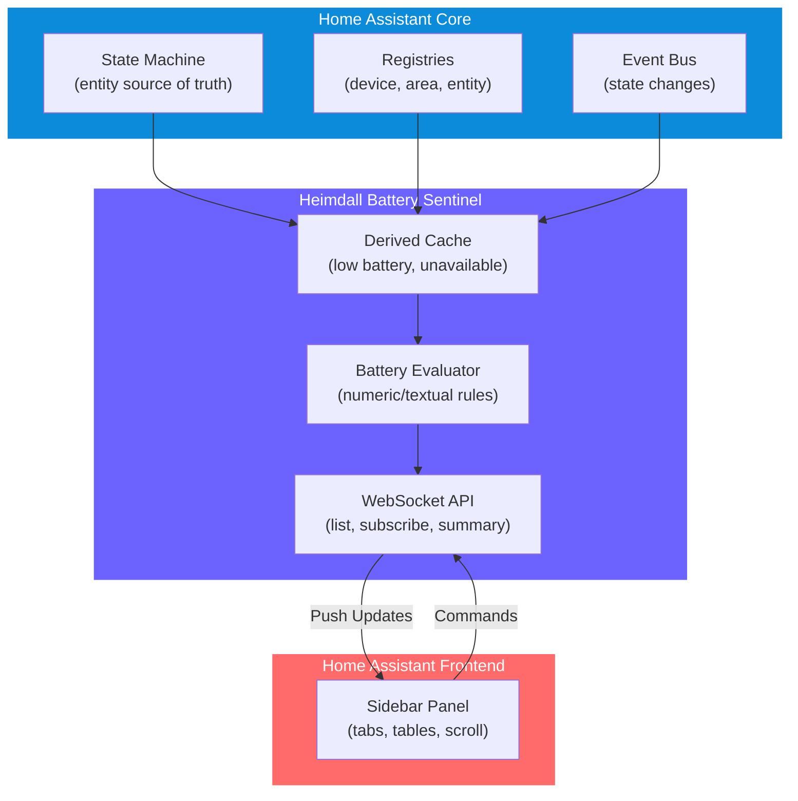
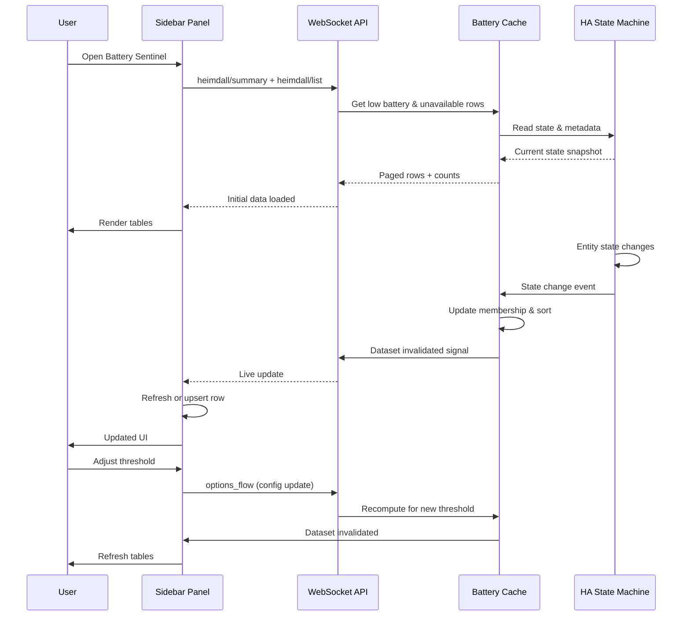

# Heimdall Battery Sentinel 🔋

A Home Assistant custom integration that provides **real-time monitoring** of low-battery devices and unavailable entities with a dedicated sidebar panel. Perfect for keeping tabs on battery-powered sensors, locks, and other wireless devices.

## ✨ Features

- **Real-time battery monitoring** — Know which devices have low battery at a glance
- **Customizable threshold** — Set your own low-battery alert level (5–100%, default 15%)
- **Unavailable detection** — Instantly see entities that have gone offline
- **Server-side sorting & pagination** — Smooth infinite scroll, even with hundreds of entities
- **Smart metadata** — Displays manufacturer, model, and area for each device
- **Live updates** — WebSocket-driven UI keeps pace with state changes

## 🏗️ Architecture



## 📊 Data Flow



## 🚀 Quick Start

### Install via HACS (recommended)

1. Add this repository as a custom repository in HACS:
   - Go to **Settings** → **Custom Repositories**
   - Add `https://github.com/declanshanaghy/heimdall-battery-sentinel`
   - Category: `Integration`

2. Install **Heimdall Battery Sentinel** from HACS

3. Restart Home Assistant

4. Add the integration:
   - Go to **Settings** → **Devices & Services** → **Create Automation** → **Heimdall Battery Sentinel**
   - Set your low-battery threshold (default: 15%)
   - A new **"Battery Sentinel"** sidebar panel will appear

### Manual Installation

1. Clone or download this repository
2. Copy `custom_components/heimdall_battery_sentinel/` to your HA `custom_components/` directory
3. Restart Home Assistant
4. Add the integration via Settings

## ⚙️ Configuration

The threshold can be adjusted after installation:

1. Go to **Settings** → **Devices & Services**
2. Find **Heimdall Battery Sentinel**
3. Click **Configure** and adjust the threshold (5–100%, step 5)
4. Changes take effect immediately; the sidebar panel will refresh

## 📋 How It Works

### Battery Detection

**Low Battery** table shows entities with:
- `device_class=battery`
- Numeric state as a percentage (e.g., `"85%"`) below your threshold, *or*
- Textual state exactly `"low"` (case-insensitive)

**Unavailable** table shows any entity with state exactly `"unavailable"`.

### Smart Sorting

- Rows are **sorted server-side** by friendly name (stable, deterministic)
- Severe batteries (red) float to the top when sorted by severity
- Tie-breaker ensures consistent paging and UI behavior

### Metadata

Each row displays:
- **Entity friendly name** (links to HA entity page)
- **Manufacturer & Model** (from device registry)
- **Area** (from device or entity area)
- **Battery level** or status text
- **Last updated** timestamp

## 🛠️ Development

### Project Structure

```
custom_components/heimdall_battery_sentinel/
├── __init__.py              # Integration setup & event subscriptions
├── const.py                 # Constants & defaults
├── config_flow.py           # Initial setup dialog
├── options_flow.py          # Threshold configuration
├── models.py                # Row data models
├── evaluator.py             # Battery evaluation rules
├── registry.py              # Metadata caching & enrichment
├── store.py                 # In-memory dataset & versioning
├── websocket.py             # WebSocket command handlers
├── manifest.json            # Integration metadata
└── www/
    └── panel-heimdall.js    # Sidebar panel UI (plain JS)
```

### Testing

```bash
# Run all tests
pytest tests/

# Run specific test file
pytest tests/test_evaluator.py -v

# Run with coverage
pytest --cov=custom_components.heimdall_battery_sentinel tests/
```

Key test coverage:
- Battery evaluation rules (numeric %, textual low/medium/high)
- Severity thresholds & color mapping
- Server-side sorting & pagination
- Event-driven cache updates
- WebSocket command validation

### Architecture Decisions

See [PLANNING_ARTIFACTS/architecture.md](./PLANNING_ARTIFACTS/architecture.md) for detailed architecture decision records (ADRs), including:
- Why we use WebSocket instead of polling
- How the event-driven cache works
- Pagination and dataset versioning strategy
- Battery evaluation rules matching the PRD

## 📦 Dependencies

- **Home Assistant** ≥ 2024.1
- **Python** ≥ 3.11

## 📝 License

MIT — See LICENSE file for details

## 🤝 Contributing

Contributions welcome! To get started:

1. Fork this repository
2. Create a feature branch (`git checkout -b feature/your-feature`)
3. Write tests for your changes
4. Ensure all tests pass (`pytest`)
5. Commit with a clear message
6. Open a pull request

## 📞 Support

For issues, feature requests, or questions:
- Open an [Issue](https://github.com/declanshanaghy/heimdall-battery-sentinel/issues)
- Check [Discussions](https://github.com/declanshanaghy/heimdall-battery-sentinel/discussions)

---

**Built with ❤️ for Home Assistant enthusiasts**
