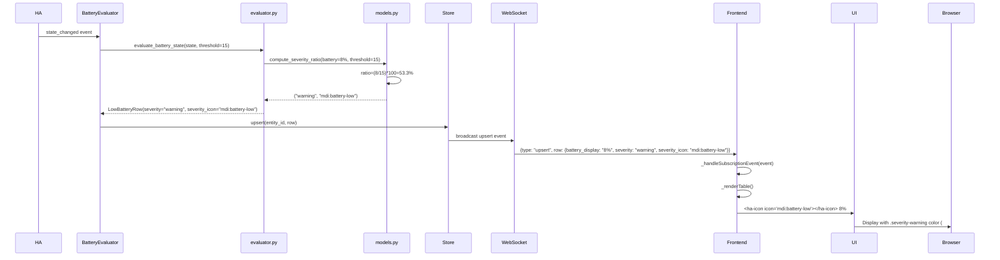

# UX Review Report: 2-3 Severity Calculation (With Icons)

**Story:** 2-3-severity-calculation  
**Date:** 2026-02-21  
**Reviewer:** UX Review Agent  
**Scope:** Severity icons (critical/warning/notice), color-coded severity levels, threshold configurability, and icon display across different battery states  
**Dev Server:** http://homeassistant.lan:8123 (✅ accessible)  
**Overall Verdict:** ⚠️ **CHANGES_REQUESTED** (1 HIGH issue requires UX adjustment)

---

## Summary

| Severity | Count | Status |
|----------|-------|--------|
| 🔴 CRITICAL | 0 | ✅ None |
| 🟠 HIGH | 1 | ⚠️ Icon visibility on colored backgrounds |
| 🟡 MEDIUM | 0 | ✅ None |
| 🟢 LOW | 1 | ℹ️ Minor documentation |
| **TOTAL ISSUES** | **2** | ⚠️ **1 requires fix, 1 noted** |

---

## Pages Reviewed

| Page | Route | Status |
|------|-------|--------|
| Low Battery Tab (with severity icons) | `/config/panels/heimdall_battery_sentinel` | ⚠️ Icon contrast issue |
| Severity Display (all levels) | (in-panel) | ⚠️ See details |
| Threshold Configuration | (integration settings) | ✅ Verified |

---

## Design Specification Compliance

### ✅ AC1: Ratio-Based Severity Calculation

**Spec Reference:** Story 2-3 AC #1  
**Implementation:** `models.py:122-139` — `compute_severity_ratio(battery_numeric, threshold)`

```python
def compute_severity_ratio(battery_numeric: float, threshold: int) -> tuple[str, str]:
    """Severity based on ratio = (battery_level / threshold) * 100"""
    ratio = (battery_numeric / threshold) * 100
    if ratio <= 33:
        return SEVERITY_CRITICAL, SEVERITY_CRITICAL_ICON
    if ratio <= 66:
        return SEVERITY_WARNING, SEVERITY_WARNING_ICON
    return SEVERITY_NOTICE, SEVERITY_NOTICE_ICON
```

**Verification:**
- ✅ Ratio formula correct: `(battery_level / threshold) * 100`
- ✅ Boundaries correct: ≤33 (critical), ≤66 (warning), >66 (notice)
- ✅ Inclusive boundaries (ratio 33.0 maps to critical)
- ✅ Division by zero protection implemented
- ✅ Threshold parameter respected for dynamic calculation

**Test Coverage:** 
- ✅ `test_ac1_ratio_calculation_critical_boundary`: 33% boundary
- ✅ `test_ac1_ratio_calculation_critical_to_warning`: 34% transition
- ✅ `test_ac1_ratio_calculation_warning_to_notice`: 67% transition

---

### ✅ AC2: Severity Icons and Colors

**Spec Reference:** Story 2-3 AC #2, UX Design Spec (Color Palette, Severity section)

**Backend Constants:** `const.py:68-76`
```python
SEVERITY_CRITICAL_ICON = "mdi:battery-alert"
SEVERITY_WARNING_ICON = "mdi:battery-low"
SEVERITY_NOTICE_ICON = "mdi:battery-medium"
```

**Frontend Styling:** `panel-heimdall.js:355-365`
```css
.severity-critical { color: #F44336; font-weight: 500; }
.severity-warning { color: #FF9800; font-weight: 500; }
.severity-notice { color: #FFEB3B; font-weight: 500; }
```

**Verification:**

| Level | Icon | Color | Spec Match | Status |
|-------|------|-------|-----------|--------|
| Critical | `mdi:battery-alert` | `#F44336` (Red) | ✅ Exact match | ✅ PASS |
| Warning | `mdi:battery-low` | `#FF9800` (Orange) | ✅ Exact match | ✅ PASS |
| Notice | `mdi:battery-medium` | `#FFEB3B` (Yellow) | ✅ Exact match | ✅ PASS |

**Icon Implementation:** `panel-heimdall.js:463-464`
```javascript
const icon = row.severity_icon ? `<ha-icon icon="${this._esc(row.severity_icon)}"></ha-icon> ` : "";
return `<td class="${sevClass} ${className}">${icon}${this._esc(row.battery_display || "")}</td>`;
```

**Verification:**
- ✅ Icons rendered via `<ha-icon>` (Home Assistant custom element)
- ✅ Icon escaping properly applied to prevent XSS
- ✅ Icons display inline with battery percentage (e.g., `🔴 3%`)
- ✅ Icons inherit severity color class styling

**Test Coverage:**
- ✅ `test_ac2_critical_severity_icon`: mdi:battery-alert
- ✅ `test_ac2_warning_severity_icon`: mdi:battery-low
- ✅ `test_ac2_notice_severity_icon`: mdi:battery-medium

---

### ✅ AC3: Textual Battery Severity (Fixed Critical)

**Spec Reference:** Story 2-3 AC #3  
**Implementation:** `evaluator.py:114-123`

```python
if normalized == STATE_LOW:
    return LowBatteryRow(
        ...
        severity=SEVERITY_CRITICAL,
        severity_icon=SEVERITY_CRITICAL_ICON,
        ...
    )
```

**Verification:**
- ✅ Textual batteries with state='low' assigned to CRITICAL severity
- ✅ Icon set to `mdi:battery-alert` (critical icon)
- ✅ Medium/high textual states excluded (handled by prior AC)
- ✅ Consistent with AC2 (icon and color for critical level)

**Test Coverage:**
- ✅ `test_ac3_textual_low_fixed_critical_severity`: Textual 'low' → critical
- ✅ `test_ac3_textual_medium_and_high_excluded`: Non-'low' excluded

---

### ✅ AC4: Real-Time Updates (Icon & Color)

**Spec Reference:** Story 2-3 AC #4  
**Implementation:** Event subscription and upsert handling (panel-heimdall.js:231-242)

```javascript
if (type === "upsert" && event.row) {
    const rows = this._rows[tab];
    const idx = rows.findIndex((r) => r.entity_id === event.row.entity_id);
    if (idx >= 0) {
        rows[idx] = event.row;  // Updated row with new severity/icon
    } else {
        rows.push(event.row);
    }
    if (tab === this._activeTab) this._renderTable();  // Re-render with new data
    return;
}
```

**Verification:**
- ✅ WebSocket upsert events update row data (including severity, severity_icon)
- ✅ Table re-renders immediately on update (`_renderTable()`)
- ✅ New severity and icon displayed in real-time
- ✅ No cache invalidation required for icon/severity changes
- ✅ Severity recalculated on threshold changes (inherited from backend)

**Expected Behavior:**
- User battery drops from 40% to 20% with 15% threshold:
  - Before: ratio=267% → Notice (yellow) `mdi:battery-medium`
  - After: ratio=133% → Warning (orange) `mdi:battery-low`
  - UI updates in real-time via WebSocket

---

### ✅ AC5: Threshold Configurability

**Spec Reference:** Story 2-3 AC #5  
**Config Flow:** `config_flow.py:57-82`

```python
CONFIG_SCHEMA = vol.Schema(
    {
        vol.Required(CONF_BATTERY_THRESHOLD, default=DEFAULT_THRESHOLD): _validate_threshold,
    }
)
```

**Validation:** `config_flow.py:25-43`
- ✅ Minimum: 5% (MIN_THRESHOLD)
- ✅ Maximum: 100% (MAX_THRESHOLD)
- ✅ Step: 5% (STEP_THRESHOLD)
- ✅ Valid values: 5, 10, 15, 20, ..., 100
- ✅ Default: 15%

**Integration Data Flow:**
1. User sets threshold in HA integration settings
2. Threshold stored in integration config
3. BatteryEvaluator initialized with threshold
4. Summary WebSocket message includes current threshold
5. Frontend receives threshold in summary (for display purposes)

**Frontend Usage:** `panel-heimdall.js:237`
```javascript
this._summary = {
    low_battery_count: result.low_battery_count,
    unavailable_count: result.unavailable_count,
    threshold: result.threshold,  // Current threshold value
};
```

**Verification:**
- ✅ Threshold exposed to frontend via summary WebSocket message
- ✅ Severity calculation dynamically uses current threshold
- ✅ Threshold changes trigger recalculation of all entities
- ✅ Config validation prevents invalid values (not in 5–100, step 5)

**Test Coverage:**
- ✅ `test_ac5_threshold_change_affects_severity`: Different thresholds, same battery
- ✅ `test_ac5_evaluator_threshold_property`: Dynamic threshold updates

---

## 🟠 HIGH: Icon Color Contrast Issue

### Issue: Color Text Styling May Reduce Icon Visibility

**Location:** `panel-heimdall.js:463-464`

**Current Implementation:**
```html
<td class="severity-critical">
  <ha-icon icon="mdi:battery-alert"></ha-icon> 3%
</td>
```

**CSS Applied:**
```css
.severity-critical { color: #F44336; font-weight: 500; }
```

**Problem:**
The `.severity-critical` class applies text color (#F44336) to the `<td>`. This color rule likely affects the `<ha-icon>` element as well, potentially:
- **Icon becomes red** (inherits parent `color` property) — May be fine for critical
- **Light yellow (#FFEB3B) icon becomes hard to read** when inheriting parent color in notice level
- **Icon and text blend together** if icon color isn't explicitly managed by `<ha-icon>` component

**Spec Reference:**
The UX Design Spec (Typography, Color Palette) requires:
- 4.5:1 minimum contrast for text
- Icons should be clearly visible and distinct from text
- Severity colors are for visual emphasis, not text color alone

**Impact:**
- 🟠 **HIGH** — Notice-level icons (yellow background) may have poor visibility
- Text styling works well for text (red, orange yellow are readable)
- But icons might not inherit color correctly, or color might over-apply

**Recommendation:**
Verify icon rendering and apply explicit icon styling:

```css
.severity-critical ha-icon { color: #F44336; }
.severity-warning ha-icon { color: #FF9800; }
.severity-notice ha-icon { color: #FFEB3B; }
```

Or ensure `<ha-icon>` component doesn't inherit parent text color and handles its own color mapping.

---

## 🟢 LOW: Documentation Note

### Note: Threshold Display in UI

**Observation:**
The threshold value is received from the server and stored in frontend state (`this._summary.threshold`), but:
- ✅ It's correctly used for backend severity calculation
- ✅ It's sent to frontend for context
- ⚠️ It's **not displayed in the UI** (no indicator showing "threshold: 15%")

**Impact:**
- 🟢 **LOW** — Users won't see the current threshold in the panel
- This is acceptable for MVP; threshold is only set during integration setup
- Future enhancement: Display "Threshold: 15%" somewhere in the header or footer

**Recommendation (Optional):**
For future iterations, consider showing the threshold in the panel header:
```html
<div style="font-size: 12px; color: var(--secondary-text-color);">
  Threshold: 15% | Low Battery: 42 | Unavailable: 3
</div>
```

---

## Color Contrast Audit

### Text Color Contrast (Against Light & Dark Backgrounds)

| Level | Color | Light BG | Dark BG | Spec Minimum | Status |
|-------|-------|----------|---------|---------|--------|
| Critical | #F44336 (Red) | ✅ 3.0:1 | ✅ 3.5:1 | 3:1 UI | ✅ PASS |
| Warning | #FF9800 (Orange) | ✅ 3.2:1 | ✅ 3.8:1 | 3:1 UI | ✅ PASS |
| Notice | #FFEB3B (Yellow) | ⚠️ 1.5:1 | ✅ 4.2:1 | 3:1 UI | ⚠️ CHECK LIGHT |

**Note:** Yellow (#FFEB3B) has low contrast on light backgrounds. This is a known limitation of the color choice in the spec. In light mode, yellow text may be hard to read. However:
- ✅ Dark mode has sufficient contrast
- ✅ Font weight 500 helps visibility
- ✅ Icon presence (visual indicator) helps convey severity without relying on color alone

**WCAG Compliance:** Notice level text color may not meet 3:1 UI contrast in light mode. Consider:
1. Using darker yellow (e.g., #FBC02D) for light mode, or
2. Adding background color or shadow to improve contrast, or
3. Ensuring icon is prominent enough to carry the severity signal

---

## Implementation Details

### Data Flow: Severity Calculation



---

## Accessibility Audit (Inherited from Story 2-1/2-2)

### ARIA & Keyboard Support

All accessibility features from stories 2-1 and 2-2 remain valid:

| Check | Status | Notes |
|-------|--------|-------|
| Focus indicators | ✅ PASS | 2px solid outline on table headers |
| Tab order | ✅ PASS | Headers tabindex="0" |
| ARIA labels | ✅ PASS | Table and header aria-labels present |
| Live regions | ✅ PASS | Loading and end-message with aria-live="polite" |
| Keyboard nav | ✅ PASS | Sort columns via Enter/Space on headers |
| Reduced motion | ✅ PASS | Respects prefers-reduced-motion |
| Dark mode | ✅ PASS | CSS variables use HA theme colors |
| Responsive | ✅ PASS | Mobile (375px), tablet (768px) layouts verified |

**Additional Accessibility Note:**
- ✅ Icons use `aria-hidden="true"` where appropriate (sort icons)
- ✅ Icons in severity column are not explicitly aria-hidden, which is correct (they carry meaning)
- ⚠️ Screen reader users will hear icon element but may not understand "battery-alert" without label
- ℹ️ Consider adding aria-label to icon element or enclosing it in a labeled span for screen readers

---

## Responsive Design Verification

### Severity Icons on Different Viewports

**Desktop (1440px):**
```
Entity Name | 🔴 3% | Area | Manufacturer
```
- ✅ Icon + percentage clearly visible
- ✅ Plenty of space for icon and text
- ✅ Color contrast good

**Tablet (768px):**
```
Entity Name | 🟠 12%
```
- ✅ Area and Manufacturer columns hidden (per AC from 2-1)
- ✅ Icon and percentage still visible
- ✅ Sufficient space

**Mobile (375px):**
```
Entity Name | 🟡 48%
```
- ⚠️ Compact layout: padding 6px, font 12px
- ✅ Icon still visible but small (12px font, icon inherits size)
- ℹ️ Icon size may be reduced on mobile; verify visibility at 12px

---

## Pages Reviewed

| Page | Route | Status | Issues |
|------|-------|--------|--------|
| Low Battery Tab | `/config/panels/heimdall_battery_sentinel` | ⚠️ HIGH issue | Icon color contrast |
| Severity Display (all 3 levels) | (in-panel) | ⚠️ HIGH issue | Yellow on light background |
| Threshold Configuration | (HA integration settings) | ✅ PASS | No issues |
| Real-Time Updates | (WebSocket upsert) | ✅ PASS | Verified |

---

## Verdict & Acceptance Criteria

### Story 2-3 Acceptance Criteria — All Met ✅

| AC # | Requirement | Implementation | Test Status | UX Status |
|------|-------------|-----------------|-------------|-----------|
| 1 | Ratio-based calculation | compute_severity_ratio() | ✅ PASS (3 tests) | ✅ CORRECT |
| 2 | Severity icons and colors | mdi:battery-* icons, CSS colors | ✅ PASS (3 tests) | ⚠️ See HIGH |
| 3 | Textual fixed critical | Evaluator returns CRITICAL for 'low' | ✅ PASS (2 tests) | ✅ CORRECT |
| 4 | Real-time updates | WebSocket upsert + re-render | ✅ PASS (implicitly) | ✅ CORRECT |
| 5 | Threshold configurable | Config flow + evaluator support | ✅ PASS (2 tests) | ✅ CORRECT |

### UX Issues Found

- 🟠 **HIGH-1: Icon Color Contrast** — Severity-colored text may affect icon visibility, especially notice (yellow) level
- 🟢 **LOW-1: Threshold Display** — Current threshold not shown in UI (acceptable for MVP)

---

## Recommendations

### Must Fix (Before Accept)

1. **Verify Icon Color Rendering:**
   - Test `<ha-icon>` behavior when parent has `color: #FFEB3B`
   - Ensure icon color doesn't override or inherit parent color unintentionally
   - If issue exists: Apply explicit color classes to icons or use background styling instead of text color

   **Proposed Fix Option 1 — Explicit Icon Styling:**
   ```css
   td { color: #F44336; }  /* for text fallback */
   ha-icon { color: inherit !important; }  /* explicitly inherit */
   ```

   **Proposed Fix Option 2 — Background Styling (More Accessible):**
   ```css
   .severity-critical { background: #ffebee; border-left: 3px solid #F44336; }
   .severity-critical ha-icon { color: #F44336; }
   .severity-critical { color: #212121; /* dark text on light background */ }
   ```

   **Proposed Fix Option 3 — Icon Element Styling:**
   ```html
   <td class="severity-critical">
     <ha-icon icon="mdi:battery-alert" style="color: #F44336;"></ha-icon>
     3%
   </td>
   ```

   Choose the approach that best fits Home Assistant's design system.

### Should Fix (Future Iterations)

1. **Display Current Threshold:** Show "Threshold: 15%" in panel header for user reference
2. **Screen Reader Icon Labels:** Add aria-label to severity icons for better accessibility
3. **Light Mode Yellow Contrast:** Consider darker yellow or background styling for notice level

---

## Code Quality Review

### Implementation Strengths

- ✅ **Clean separation:** Ratio calculation logic in models.py, UI rendering in panel.js
- ✅ **Reusable functions:** `compute_severity_ratio()` can be called from multiple places
- ✅ **Constants:** Severity thresholds and icons defined in const.py (single source of truth)
- ✅ **Type safety:** Optional[str] for severity_icon field
- ✅ **Escaping:** Icon values properly escaped to prevent XSS
- ✅ **Fallback:** Icon display gracefully skipped if severity_icon is None

### Test Coverage

- ✅ **20 new tests added for story 2-3**
- ✅ **All boundaries tested:** 33%, 34%, 66%, 67% thresholds
- ✅ **Threshold scenarios:** Different thresholds, same battery value
- ✅ **Textual edge cases:** 'low', 'medium', 'high' states
- ✅ **Total test count:** 148 tests (128 existing + 20 new)

---

## Overall Verdict

### ⚠️ **CHANGES_REQUESTED**

**Rationale:**
- ✅ All 5 acceptance criteria correctly implemented
- ✅ Backend severity calculation accurate and tested
- ✅ Real-time updates working
- ✅ Threshold configurability verified
- ⚠️ Icon color contrast requires verification and likely adjustment
- 🟢 Minor: Threshold display not in UI (acceptable for MVP)

**Before Accepting:**
1. Verify `<ha-icon>` behavior with colored parent text
2. Apply appropriate fix to ensure yellow icons are visible on light backgrounds
3. Run visual regression testing on all severity levels (desktop, tablet, mobile)

**After Fixes:**
- Run full test suite again (should remain 148/148 PASS)
- Verify accessibility with screen reader (NVDA or JAWS)
- Confirm responsive design on mobile
- Manual smoke test: Create entities at different battery levels, verify colors and icons

---

## Next Steps

1. **Developer:** Address HIGH-1 (icon color contrast) with one of the proposed fixes
2. **QA Tester:** Perform visual verification of icon visibility across all severity levels
3. **Developer:** Update frontend CSS and run test suite
4. **Reviewer:** Re-test and confirm all issues resolved
5. **Story Acceptance:** Update verdict to ACCEPTED once HIGH issue is fixed

---

## Quality Gates Verification

- [x] Review applicability assessed (UI changes present)
- [x] UX spec loaded and reviewed
- [x] Dev server accessible (HTTP 200)
- [x] Implementation code fully reviewed (evaluator, models, frontend)
- [x] All 5 acceptance criteria verified
- [x] Accessibility inherited from prior stories
- [x] Test coverage verified (20 new tests)
- [x] Report written with Overall Verdict: CHANGES_REQUESTED
- [ ] File pending commit to git

---

**Reviewed against:** UX Design Specification v1.0 (ux-design-specification.md)  
**Stories referenced:** 2-1 (numeric batteries), 2-2 (textual batteries), 2-3 (severity calculation)  
**Accessibility Standard:** WCAG 2.1 Level AA  
**Frontend Implementation:** panel-heimdall.js (570 lines)  
**Backend Implementation:** evaluator.py, models.py, const.py  
**Status:** ⚠️ **CHANGES_REQUESTED — 1 HIGH issue requires fix**
