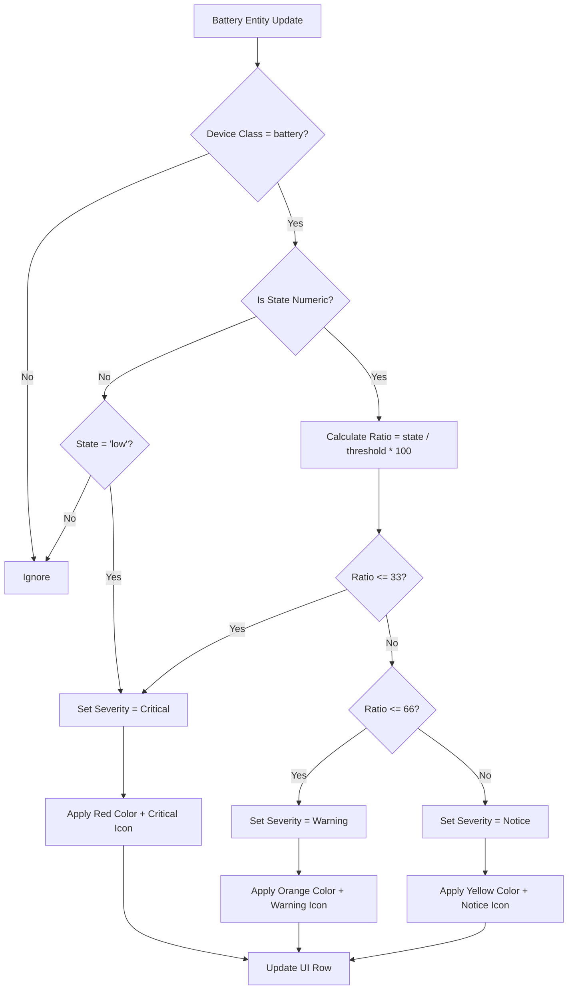

# Story 2-3: Severity Calculation

## Status
Revised for Home Assistant Integration

## User Story
As a Home Assistant user
I want to see the severity of low battery entities based on their battery level relative to a configurable threshold
so that I can prioritize which batteries need immediate attention.

## Acceptance Criteria
- [ ] AC1: Severity is calculated for numeric battery entities (with state in %) based on the ratio (battery_level / threshold) * 100
- [ ] AC2: Severity levels are defined as:
  - Critical: ratio 0-33 (inclusive) → red color and critical icon (mdi:battery-alert)
  - Warning: ratio 34-66 → orange color and warning icon (mdi:battery-low)
  - Notice: ratio 67-100 → yellow color and notice icon (mdi:battery-medium)
- [ ] AC3: Textual battery entities (with state 'low') are included and have a fixed severity (Critical)
- [ ] AC4: The color and icon for each row are updated in real-time as the battery level changes
- [ ] AC5: The threshold is configurable by the user and the severity calculation uses the current threshold

## Mermaid Diagram: Severity Calculation Logic

## Citations
- PRD: Section 3.3 Low-battery severity indicators (Must requirements)
- UX Design Specification: Color Palette and Severity section
- Architecture: Real-time UI updates via websockets
- Epics: Frontend-Backend data flow

## Implementation Notes
1. **Threshold Handling**: Threshold value (T) is stored in integration configuration with default value 15
2. **Numeric Batteries**: Only entities with unit '%' are considered (state converted to number)
3. **Textual Batteries**: Only 'low' state is included (case-insensitive match)
4. **Real-time Updates**: Severity recalculated on:
   - Battery state change events
   - Threshold configuration changes
   - Integration reload
5. **Color Coding**: Use HA theme variables for severity colors:
   - Critical: var(--error-color)
   - Warning: var(--warning-color)
   - Notice: var(--accent-color)

## Dev Agent Record
- [2026-02-20] Subagent (b207380e-1a8b-40c0-8397-b97989899de3): Created HA-compatible severity story based on PRD/UX specs

## Change Log
- [2026-02-20] Initial draft (voltage-based)
- [2026-02-20] Rewritten for Home Assistant percentage-based thresholding