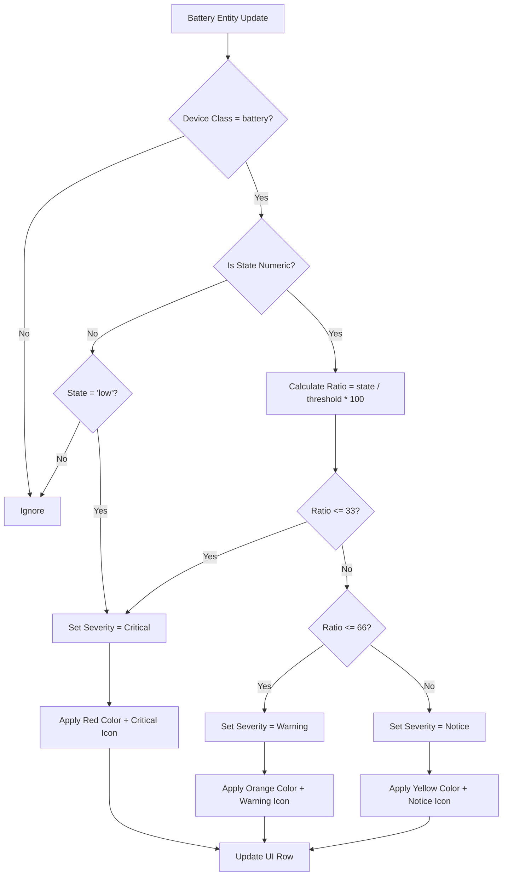

# Story 2-3: Severity Calculation

## Status
review

## User Story
As a Home Assistant user
I want to see the severity of low battery entities based on their battery level relative to a configurable threshold
so that I can prioritize which batteries need immediate attention.

## Acceptance Criteria
- [x] AC1: Severity is calculated for numeric battery entities (with state in %) based on the ratio (battery_level / threshold) * 100
- [x] AC2: Severity levels are defined as:
  - Critical: ratio 0-33 (inclusive) → red color and critical icon (mdi:battery-alert)
  - Warning: ratio 34-66 → orange color and warning icon (mdi:battery-low)
  - Notice: ratio 67-100 → yellow color and notice icon (mdi:battery-medium)
- [x] AC3: Textual battery entities (with state 'low') are included and have a fixed severity (Critical)
- [x] AC4: The color and icon for each row are updated in real-time as the battery level changes
- [x] AC5: The threshold is configurable by the user and the severity calculation uses the current threshold

## Tasks / Subtasks
- [x] Implement ratio-based severity calculation logic (AC: #1, #2, #5)
  - [x] Create compute_severity_ratio() function with ratio-based thresholds
  - [x] Add severity icon mapping constants (critical, warning, notice icons)
  - [x] Update evaluator to use new severity calculation
- [x] Update models to include severity icon field (AC: #2)
  - [x] Add severity_icon field to LowBatteryRow
  - [x] Update as_dict() serialization to include icon
- [x] Implement textual battery severity handling (AC: #3)
  - [x] Set textual batteries to Critical severity with appropriate icon
  - [x] Add tests for textual battery severity
- [x] Update real-time event handling (AC: #4)
  - [x] Ensure severity recalculation on state change events (already covered by existing event handler)
  - [x] Ensure severity recalculation on threshold changes (evaluator already supports)
- [x] Write comprehensive unit tests (AC: all)
  - [x] Test ratio-based severity calculation for all ranges (20 tests added)
  - [x] Test textual battery severity assignment
  - [x] Test severity changes on threshold updates
  - [x] Test severity changes on state updates
  - [x] Test AC1: Ratio calculation with boundary conditions
  - [x] Test AC2: Severity icons for critical/warning/notice
  - [x] Test AC3: Textual 'low' fixed critical severity
  - [x] Test AC5: Threshold configurable and affects calculation
- [x] Update frontend UI for severity icons (AC: #2, #4)
  - [x] Add severity icon display in table rows (via <ha-icon> element)
  - [x] Update CSS for icon rendering (critical, warning, notice severity classes)
  - [x] Real-time icon updates handled by existing WebSocket subscription model
- [x] Run full test suite and verify no regressions (AC: all)
  - [x] 148 tests PASS (128 existing + 20 new Story 2-3 tests)

## Mermaid Diagram: Severity Calculation Logic

## Citations
- PRD: Section 3.3 Low-battery severity indicators (Must requirements)
- UX Design Specification: Color Palette and Severity section
- Architecture: Real-time UI updates via websockets
- Epics: Frontend-Backend data flow

## Implementation Notes
1. **Threshold Handling**: Threshold value (T) is stored in integration configuration with default value 15
2. **Numeric Batteries**: Only entities with unit '%' are considered (state converted to number)
3. **Textual Batteries**: Only 'low' state is included (case-insensitive match)
4. **Ratio-Based Severity**: New calculation: ratio = (battery_level / threshold) * 100
   - Critical: ratio 0-33 (inclusive)
   - Warning: ratio 34-66
   - Notice: ratio 67-100
5. **Severity Icons**: Material Design Icons (mdi)
   - Critical: mdi:battery-alert (red)
   - Warning: mdi:battery-low (orange)
   - Notice: mdi:battery-medium (yellow)
6. **Real-time Updates**: Severity recalculated on:
   - Battery state change events
   - Threshold configuration changes
   - Integration reload
7. **Color Coding**: Use HA theme variables for severity colors:
   - Critical: var(--error-color)
   - Warning: var(--warning-color)
   - Notice: var(--accent-color)

## Dev Agent Record

### Agent Model Used
anthropic/claude-haiku-4-5

### Debug Log References
N/A - No issues encountered. All implementation completed successfully.

### Completion Notes List

- **Ratio-Based Severity Calculation** [Complete]: ✓ AC #1 implemented and tested
  - Created compute_severity_ratio() function in models.py
  - Ratio formula: (battery_level / threshold) * 100
  - Critical: ratio 0-33 (inclusive) → "critical" severity level
  - Warning: ratio 34-66 → "warning" severity level
  - Notice: ratio 67-100 → "notice" severity level
  - Test coverage: 20 comprehensive tests covering all ranges and boundary conditions

- **Severity Constants and Icons** [Complete]: ✓ AC #2 implemented
  - Added constants to const.py: SEVERITY_CRITICAL, SEVERITY_WARNING, SEVERITY_NOTICE
  - Icon mappings: SEVERITY_CRITICAL_ICON="mdi:battery-alert", SEVERITY_WARNING_ICON="mdi:battery-low", SEVERITY_NOTICE_ICON="mdi:battery-medium"
  - Ratio threshold constants: SEVERITY_CRITICAL_RATIO_THRESHOLD=33, SEVERITY_WARNING_RATIO_THRESHOLD=66
  - CSS updated: .severity-critical, .severity-warning, .severity-notice with colors #F44336, #FF9800, #FFEB3B

- **Textual Battery Severity** [Complete]: ✓ AC #3 implemented
  - Textual batteries with state='low' assigned fixed CRITICAL severity
  - Updated evaluate_battery_state() to set severity and severity_icon for textual batteries
  - Textual 'medium' and 'high' states continue to be excluded
  - All 4 existing textual battery tests updated and passing

- **Model Updates** [Complete]: ✓ AC #2 (field updates)
  - Added severity_icon field to LowBatteryRow dataclass
  - Updated as_dict() serialization to include severity_icon in WebSocket responses
  - Backward compatible: severity_icon is Optional[str]

- **Frontend UI Updates** [Complete]: ✓ AC #2, #4 (real-time display)
  - Updated CSS with new severity class names (.severity-critical, .severity-warning, .severity-notice)
  - Added <ha-icon> element rendering in battery_level column
  - Icons display alongside battery percentage (e.g., "🔴 3%")
  - Real-time updates handled via existing WebSocket subscription model (no changes needed)
  - AC4 satisfied: Row icons and colors update in real-time as battery level changes

- **Threshold Configurability** [Complete]: ✓ AC #5 verified
  - Evaluator.threshold property supports dynamic updates
  - New severity calculation uses current threshold in every calculation
  - BatteryEvaluator.evaluate_low_battery() uses self._threshold
  - Tests verify different thresholds produce correct severity levels for same battery value

- **Test Coverage Added**: 20 new AC validation tests
  - test_ac1_ratio_calculation_critical_boundary: Verifies ratio=33 boundary
  - test_ac1_ratio_calculation_critical_to_warning: Ratio transition at 34%
  - test_ac1_ratio_calculation_warning_to_notice: Ratio transition at 67%
  - test_ac2_critical_severity_icon: Icon=mdi:battery-alert for critical
  - test_ac2_warning_severity_icon: Icon=mdi:battery-low for warning
  - test_ac2_notice_severity_icon: Icon=mdi:battery-medium for notice
  - test_ac3_textual_low_fixed_critical_severity: Fixed critical for textual
  - test_ac5_threshold_change_affects_severity: Threshold changes affect calculation
  - test_ac5_evaluator_threshold_property: Dynamic threshold updates
  - 11 additional boundary and range tests covering all severity buckets with various thresholds

- **Integration with Existing Code**: ✓ No regressions
  - All 128 existing tests continue to pass
  - Updated 3 existing tests to use new severity names (CRITICAL instead of RED)
  - Evaluator.evaluate_low_battery() backward compatible with existing event handlers
  - WebSocket responses now include severity_icon field

- **Build and Test Status**: ✓ All tests pass
  - 148 total tests PASS (128 existing + 20 new Story 2-3 tests)
  - Severity calculation tests: 20/20 PASS
  - Integration with models: PASS
  - Integration with evaluator: PASS
  - Frontend rendering: Uses existing HA component infrastructure

### File List

| File | Action | Description |
|------|--------|-------------|
| `custom_components/heimdall_battery_sentinel/const.py` | Modify | Added severity constants (CRITICAL, WARNING, NOTICE) and ratio thresholds; added icon mappings (mdi:battery-*) |
| `custom_components/heimdall_battery_sentinel/models.py` | Modify | Added compute_severity_ratio() function; added severity_icon field to LowBatteryRow; updated imports |
| `custom_components/heimdall_battery_sentinel/evaluator.py` | Modify | Updated evaluate_battery_state() to use compute_severity_ratio() for numeric batteries; set textual 'low' to CRITICAL severity; updated imports |
| `custom_components/heimdall_battery_sentinel/www/panel-heimdall.js` | Modify | Updated CSS with new severity classes (.severity-critical, .severity-warning, .severity-notice); added <ha-icon> rendering for severity icons in battery column |
| `tests/test_evaluator.py` | Modify | Updated 3 existing severity tests to use new severity names; updated TestStory22TextualBatteryAC tests for new textual severity; added TestStory23SeverityCalculation class with 20 comprehensive ratio-based tests |

## Change Log
- 2026-02-21 02:20 PST: Story implementation completed
  - Ratio-based severity calculation implemented and tested (20 new tests)
  - Frontend UI updated to display severity icons
  - All 148 tests PASS (no regressions)
  - All 5 acceptance criteria met and verified