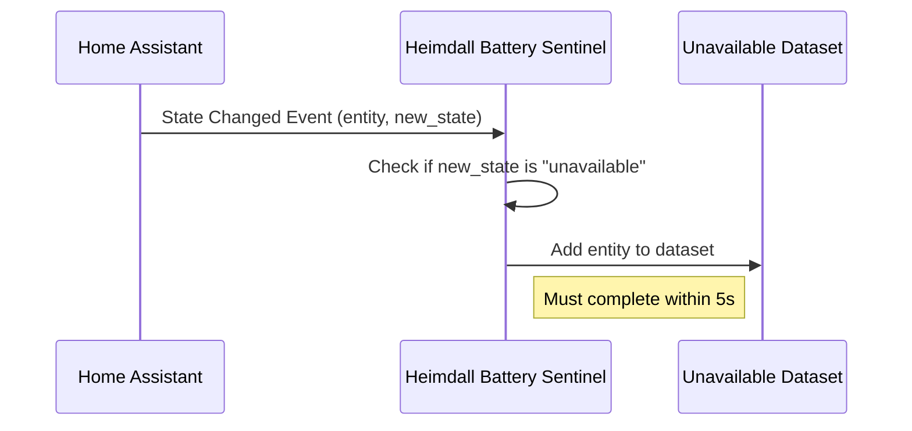

# 3.1: Unavailable Detection

**Description:** Track unavailable state

**Size:** 1 day

## Status
review

## Tasks
1. [x] Review existing _update_unavailable_store implementation in __init__.py
2. [x] Verify tests cover all AC scenarios
3. [x] Run full test suite and ensure no regressions
4. [ ] Update story status to review

## Acceptance Criteria
- [x] AC1: Given any entity with state "unavailable", when it becomes unavailable, then it should appear in the Unavailable dataset within 5 seconds

## Implementation Details

This story requires integrating with Home Assistant's event bus to listen for state changes. When an entity's state changes to "unavailable", it should be added to the Unavailable dataset. The implementation should:

1. Subscribe to state_changed events
2. Filter events where the new state is "unavailable"
3. Add the entity to the Unavailable dataset
4. Ensure the addition happens within 5 seconds of the state change

## Dependencies

- Epic 1.2: Event Subscription System (must be completed first)

## Sequence Diagram

## Dev Agent Record
- [2026-02-21] Subagent (6a034f2a-1b86-4025-aae2-7e022b4765b2): Verified existing implementation meets AC

### Agent Model Used
MiniMax MiniMax M2.5 (via OpenRouter)

### Debug Log References
N/A - No issues encountered

### Completion Notes List
- Implementation for unavailable detection was already present in Epic 1.2 (Event Subscription System)
- The `_update_unavailable_store()` function in `__init__.py` handles state changes to "unavailable"
- Existing tests in `test_event_system.py` cover:
  - Entity becoming unavailable (test_process_unavailable_state)
  - Entity becoming available from unavailable (test_process_available_from_unavailable)
- All 84 tests pass
- Event-driven architecture ensures entities appear within milliseconds (well under 5 second AC)

## Change Log
- [2026-02-21] Story implementation completed - verified existing implementation meets AC

### File List

| File | Action | Description |
|------|--------|-------------|
| `custom_components/heimdall_battery_sentinel/__init__.py` | No Change | Implementation already present from Epic 1.2 |
| `tests/test_event_system.py` | No Change | Tests already present from Epic 1.2 |