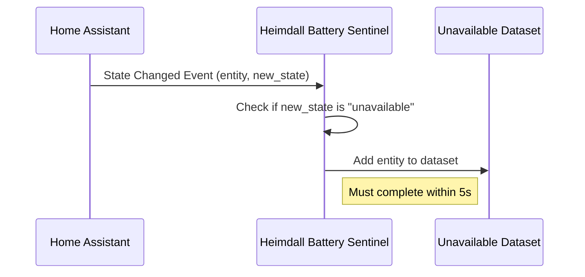

# 3.1: Unavailable Detection

**Description:** Track unavailable state

**Size:** 1 day

## Acceptance Criteria

- Given any entity with state "unavailable"
- When it becomes unavailable
- Then it should appear in the Unavailable dataset within 5 seconds

## Implementation Details

This story requires integrating with Home Assistant's event bus to listen for state changes. When an entity's state changes to "unavailable", it should be added to the Unavailable dataset. The implementation should:

1. Subscribe to state_changed events
2. Filter events where the new state is "unavailable"
3. Add the entity to the Unavailable dataset
4. Ensure the addition happens within 5 seconds of the state change

## Dependencies

- Epic 1.2: Event Subscription System (must be completed first)

## Sequence Diagram

