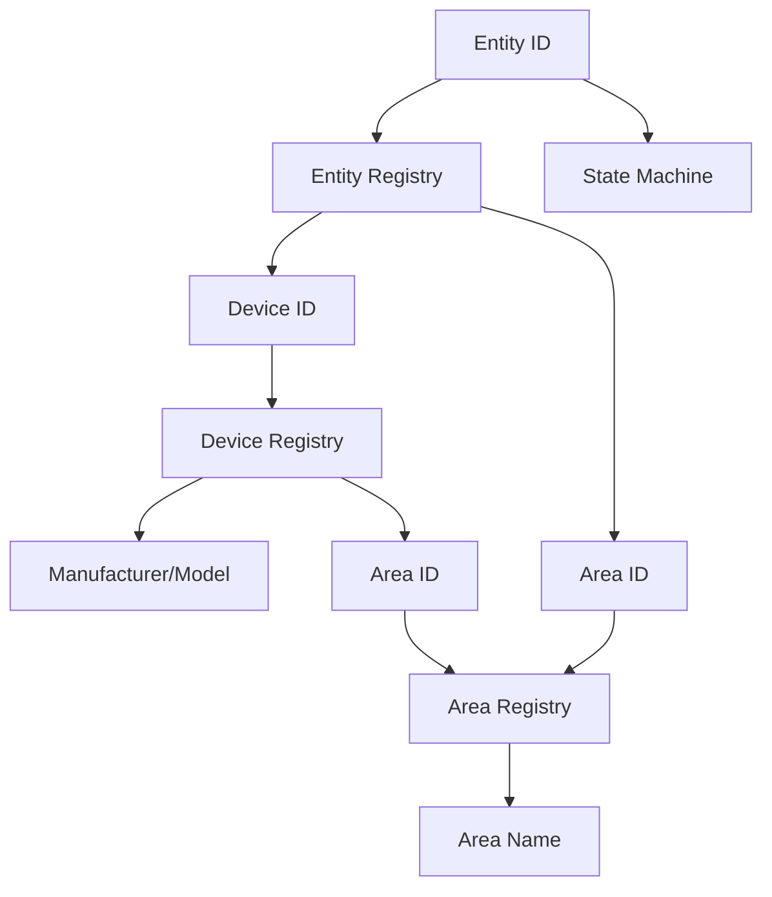

# Story: Metadata Enrichment for Battery and Unavailable Entities

**Status:** Draft  
**Story Key:** 3-2-metadata-enrichment  
**Created:** 2026-02-20  
**Author:** Development Agent  

## Story
As a Home Assistant user,  
I need to see manufacturer, model, and area information for entities in both the Low Battery and Unavailable tables,  
So that I can quickly identify devices and their locations when addressing battery or availability issues.

## Acceptance Criteria
1. For each entity in the Low Battery and Unavailable datasets:
   - Resolve and display the manufacturer name from the device registry
   - Resolve and display the model from the device registry
   - Resolve and display the area name from the area registry
2. If manufacturer/model information is unavailable, display "Unknown"
3. If area information is unavailable, display "Unassigned"
4. Metadata must update in real-time when device/area registries change
5. Implementation must follow the metadata resolution rules from ADR-006 in architecture.md

## Tasks/Subtasks
1. Backend implementation:
   - [ ] Extend row models to include manufacturer, model, and area fields
   - [ ] Implement registry lookup logic in registry.py
   - [ ] Add cache invalidation for device/area registry events
   - [ ] Update websocket payloads to include new metadata fields

2. Frontend implementation:
   - [ ] Add manufacturer/model column to both tables
   - [ ] Add area column to both tables
   - [ ] Implement proper null value display ("Unknown", "Unassigned")

3. Testing:
   - [ ] Verify metadata resolution with sample entities
   - [ ] Test cache invalidation on registry changes
   - [ ] Verify UI displays correct metadata in both tables

## Dev Notes
### Source Citations:
1. **PRD.md** (Section 3.2, 3.3) - Specifies required columns including Manufacturer & Model and Area  
2. **Architecture.md** (ADR-006) - Details metadata enrichment implementation using HA registries  
3. **Epics.md** (Epic 3.2) - Defines metadata enrichment story requirements  
4. **ux-design-specification.md** (Component Library) - Specifies table display conventions

### Technical Approach:
- Use HA's device registry to resolve manufacturer/model via device_id
- Use HA's area registry to resolve area names
- Implement caching with the following priority:
  1. Device's area (from device registry)
  2. Entity's area (from entity registry)
- Handle null values consistently:
  - Manufacturer: "Unknown"
  - Model: "Unknown"
  - Area: "Unassigned"

## Dev Agent Record
- **2026-02-20**: Story created by Development Agent

## Change Log
- **2026-02-20**: Initial story created