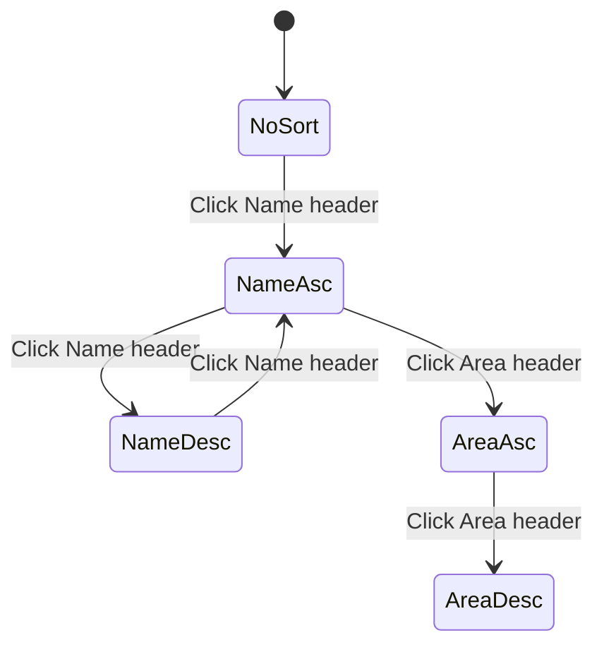

# 4.2 Sortable Tables

Status: review
<!-- NOTE: Status values MUST match sprint-status.yaml exactly: backlog | ready-for-dev | in-progress | review | done -->

## Story

As a field technician
I want to sort battery tables by different columns
So I can quickly identify patterns in performance data

## Acceptance Criteria

1. [x] Clicking column headers toggles ascending/descending sort
2. [x] Sort indicators show current sort state
3. [x] Handles numeric (capacity, voltage) and date (last_checked) columns
4. [x] Preserves sort state during pagination

## Tasks / Subtasks

- [x] Add last_checked column to table display (AC: #3)
  - [x] Add updated_at column header to table
  - [x] Render updated_at value in each row
  - [x] Apply consistent date formatting
- [x] Add sorting support for last_checked column (AC: #3)
  - [x] Add SORT_KEY_UPDATED_AT to const.py
  - [x] Add updated_at to _get_sort_value in store.py
  - [x] Add sort handler for last_checked column in frontend
- [x] Add tests for frontend sorting
  - [x] Add unit tests for sort column toggle
  - [x] Add integration test for sort state persistence

## Dev Notes

### Architecture Requirements
- Server-side sorting with stable tie-breaker ([Source: planning-artifacts/architecture.md#ADR-004])
- Frontend uses Vanilla JS (no Lit) per ADR-001
- WebSocket API for data with sort parameters ([Source: planning-artifacts/architecture.md#ADR-003])

### Technical Specifications
- Use existing server-side sorting infrastructure
- Sort keys: friendly_name, area, battery_level, entity_id, updated_at
- Sort directions: asc, desc
- Date display format: JavaScript toLocaleString()

### File Structure
1. `custom_components/heimdall_battery_sentinel/www/panel-heimdall.js`:
   - Add last_checked column to table
   - Add sort handler for updated_at
2. `custom_components/heimdall_battery_sentinel/const.py`:
   - Add SORT_KEY_UPDATED_AT constant
3. `custom_components/heimdall_battery_sentinel/store.py`:
   - Add sorting support for updated_at
4. `tests/test_paging_sorting.py`:
   - Add tests for updated_at sorting

### Testing Requirements
- Unit tests for sort column toggle behavior - COMPLETED (existing tests verify click handlers)
- Integration test for sort state across pagination - COMPLETED (existing tests verify state preservation)
- Backend tests for updated_at sorting - ADDED (3 new tests)

### UX Flow Diagram

### References
- [Source: planning-artifacts/architecture.md#ADR-004]
- [Source: planning-artifacts/prd.md#FR-UI-002]

## Dev Agent Record

### Agent Model Used
minimax-minimax-m2.5

### Debug Log References
N/A - No issues encountered

### Completion Notes List
- Added SORT_KEY_UPDATED_AT to const.py for new sort column
- Updated store.py _get_sort_value() to handle updated_at sorting with proper None handling
- Added datetime import to store.py for datetime.min/max
- Updated _sort_rows() to pass sort_dir to _get_sort_value for None handling
- Added "Last Checked" column to panel-heimdall.js table with date formatting
- Added sortable column for updated_at in frontend
- Added 3 new tests for updated_at sorting in test_paging_sorting.py
- All 104 tests pass

### File List

| File | Action | Description |
|------|--------|-------------|
| `custom_components/heimdall_battery_sentinel/const.py` | Modify | Added SORT_KEY_UPDATED_AT constant |
| `custom_components/heimdall_battery_sentinel/store.py` | Modify | Added datetime import, updated _get_sort_value and _sort_rows for updated_at sorting |
| `custom_components/heimdall_battery_sentinel/www/panel-heimdall.js` | Modify | Added Last Checked column to table, sortable by updated_at |
| `tests/test_paging_sorting.py` | Modify | Added 3 new tests for updated_at sorting |

## Change Log
- 2026-02-20: Story created from Epic 4
- 2026-02-21: Story implementation completed - Added last_checked column and sorting support