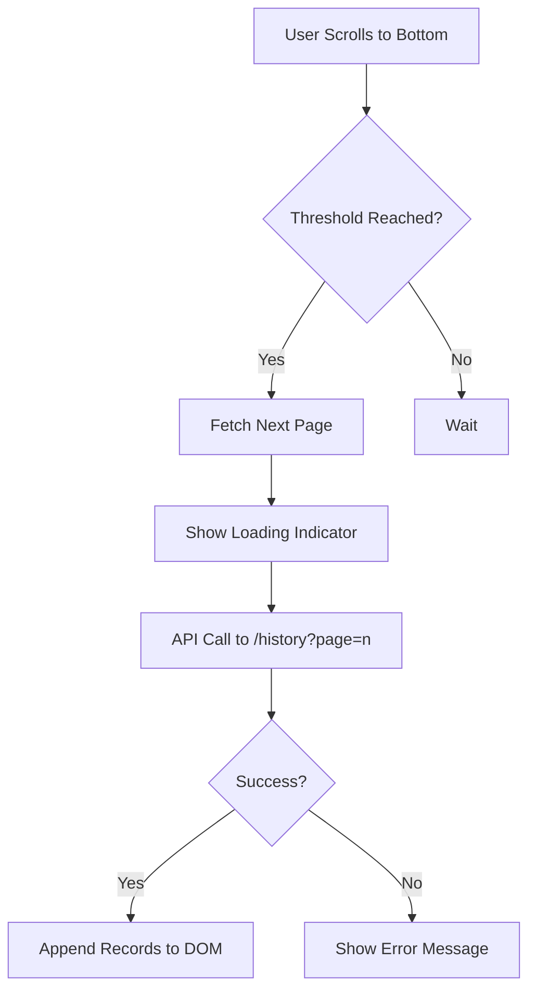

# 4.3 Infinite Scroll Feature

## Description
Implement infinite scroll functionality for the battery history view to allow users to seamlessly load more data as they scroll down without pagination.

## Business Value
- Improved user experience by eliminating pagination barriers
- Increased engagement with historical data
- Reduced perceived load times for large datasets

## User Flow
1. User opens battery history page
2. Initially loads first 50 records
3. As user scrolls to bottom, next set of records loads automatically
4. Loading indicator appears during data fetch
5. New records are appended to the bottom

## Technical Flow

## Acceptance Criteria
1. ✅ Loads additional records when user scrolls within 200px of bottom
2. ✅ Displays loading spinner during fetch
3. ✅ Maintains scroll position after new records load
4. ✅ Handles API errors gracefully
5. ✅ Displays 'No more records' message when end reached

## Implementation Notes
- Use Intersection Observer API for scroll detection
- Throttle API calls to prevent excessive requests
- Cache loaded pages to minimize redundant fetches