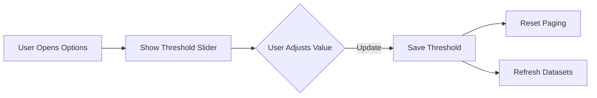

# Story: Threshold Setup

## Description
As a user, I want to configure a battery alert threshold so I can receive notifications when battery levels fall below my specified value.

## Acceptance Criteria
1. Threshold setting should appear in HA config flow / options flow
2. Default threshold should be 15%
3. Allow threshold range between 5-100% with 5% increments
4. The threshold value should persist across HA restarts
5. When threshold is updated, datasets should refresh and pagination reset

## Implementation Notes
- Configure as a number input in options flow
- Use min=5, max=100, step=5
- Store in config entry options
- Trigger dataset refresh on threshold change

## Diagrams

## Citations
- HA Config Entries: https://www.home-assistant.io/docs/config_entries_options_flow_handler/
- HA Number Input: https://www.home-assistant.io/docs/blueprint/selectors/#number-selector