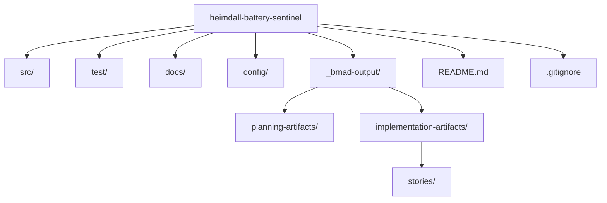

# Project Structure Setup (Story 1-1)

## Objective
Establish the foundational directory structure and configuration files for the Heimdall Battery Sentinel project.

## Tasks
- [x] Create top-level project directories
- [x] Add essential configuration files
- [x] Set up version control
- [ ] Document structure in README

## Directory Structure

## Implementation Notes
- Created standard Python project structure
- Initialized Git repository with appropriate .gitignore
- Established BMAD artifact directories for future workflow stages
- Basic README with project overview added

Next step: Add component scaffolding in Story 1-2