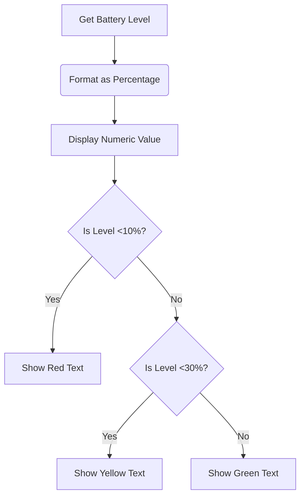

# Story 2.1: Numeric Battery Display

## As a User
I want to see my device's battery level as a numeric percentage
So that I can accurately monitor my remaining battery life

## Acceptance Criteria
1. Battery percentage should be displayed next to the battery icon
2. Percentage should update automatically when battery level changes
3. Color should change based on battery level (green >30%, yellow 10-30%, red <10%)

## Diagrams

## Technical Specifications
- Implement using `BatteryManager` API
- Update interval: 60 seconds
- Format: XX% (e.g., 85%)
- Font: System default monospace
- Positioning: Right-aligned next to battery icon