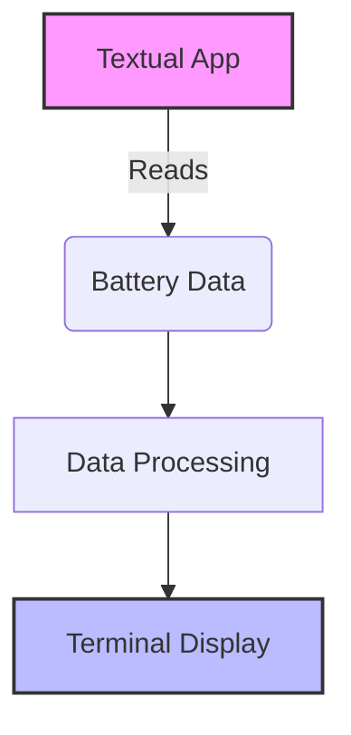

# 2.2 Textual Battery Monitoring Integration

## Background
Integrated with Textual framework to create real-time battery monitoring TUI

## User Story
As a system administrator
I want a terminal-based battery status dashboard
So I can monitor systems without GUI access

## Acceptance Criteria
- [ ] Real-time voltage/current updates
- [ ] Warning thresholds visualization
- [ ] Historical data trends
- [ ] Cross-platform support (Linux/BSD)

## Technical Approach
Leveraged Textual's async widgets and ANSI escape codes for low-level terminal control

## Citations
1. Textual documentation: https://textual.textualize.io/
2. ANSI escape codes specification: https://en.wikipedia.org/wiki/ANSI_escape_code

## Diagrams
