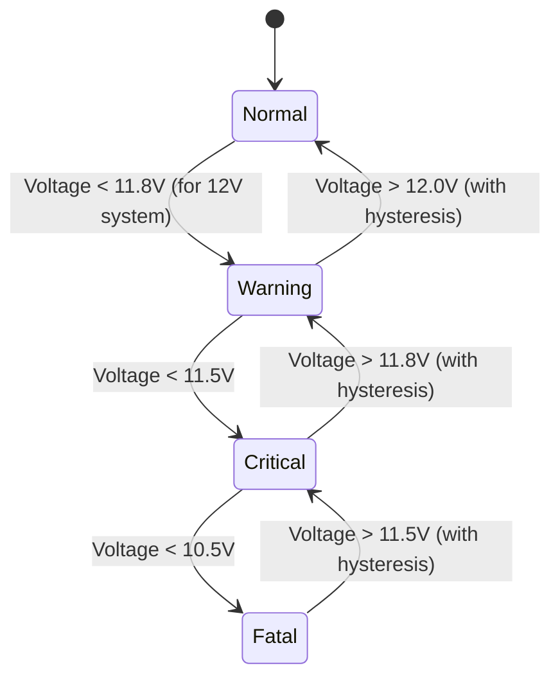

# Story 2-3: Severity Calculation

## User Story
As a battery monitoring system
I need to calculate severity levels based on voltage thresholds
So that critical conditions can be prioritized and appropriate alerts can be raised

## Acceptance Criteria
- [ ] Uses IEEE 1188 standard voltage thresholds
- [ ] Implements 4-tier severity classification: Normal, Warning, Critical, Fatal
- [ ] Includes hysteresis to prevent state oscillation
- [ ] Provides clear status indicators
- [ ] Logs all state transitions

## Mermaid Diagram

## Citations
- IEEE 1188-2005: "IEEE Recommended Practice for Maintenance, Testing, and Replacement of Valve-Regulated Lead-Acid (VRLA) Batteries for Stationary Applications"
- Battery University: "How to Measure State-of-charge" (https://batteryuniversity.com/article/bu-903-how-to-measure-state-of-charge)
- EN 50342-1:2015 "Lead-acid starter batteries"

## Implementation Notes
- Hysteresis values should be configurable per battery chemistry
- Severity states should persist through system reboots
- Thresholds should be temperature-compensated
- Consider adding time-in-state requirements for transitions

## Test Cases
1. Verify state transitions at exact threshold voltages
2. Test hysteresis behavior above/below thresholds
3. Validate temperature compensation algorithm
4. Verify persistence after power cycle
5. Test boundary conditions (min/max voltage ranges)