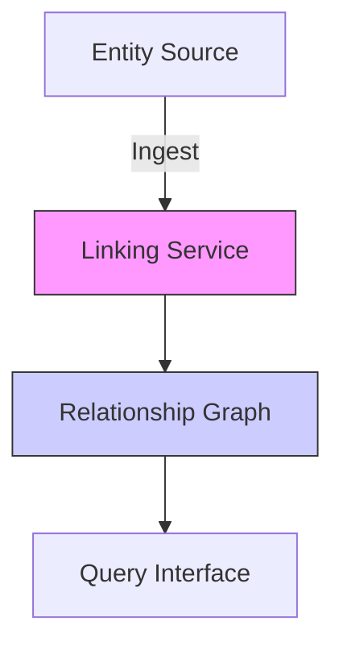

# 4.4 Entity Linking

**Intent:** To enable linking between battery-related entities (e.g., devices, sensors, locations) in the Heimdall Battery Sentinel system to support complex queries and relationship analysis.

**Actors:**
- System Administrator
- Monitoring Service
- Data Ingestion Pipeline

**Preconditions:**
1. Battery entities exist in the system
2. Entity relationship schema is defined
3. Required linking data is available

**Triggers:**
- New entity data is ingested
- Administrator requests entity linking

**Standard Flow:**
1. [TODO: Describe standard linking process]
2. [TODO: Describe validation steps]
3. [TODO: Describe persistence mechanism]

**Alternative Flows:**
* [TODO: Describe partial matching scenario]
* [TODO: Describe conflict resolution]

**Postconditions:**
- Entities are linked with validated relationships
- Relationship graph is updated
- Linked entities are available for querying

**Citations:**
- [TODO: Add relevant citations to entity linking research]
- [TODO: Reference relationship database documentation]

**Diagrams:**

*TODO: Replace with final diagram*