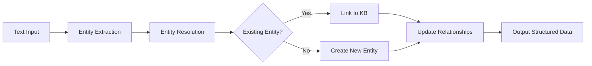
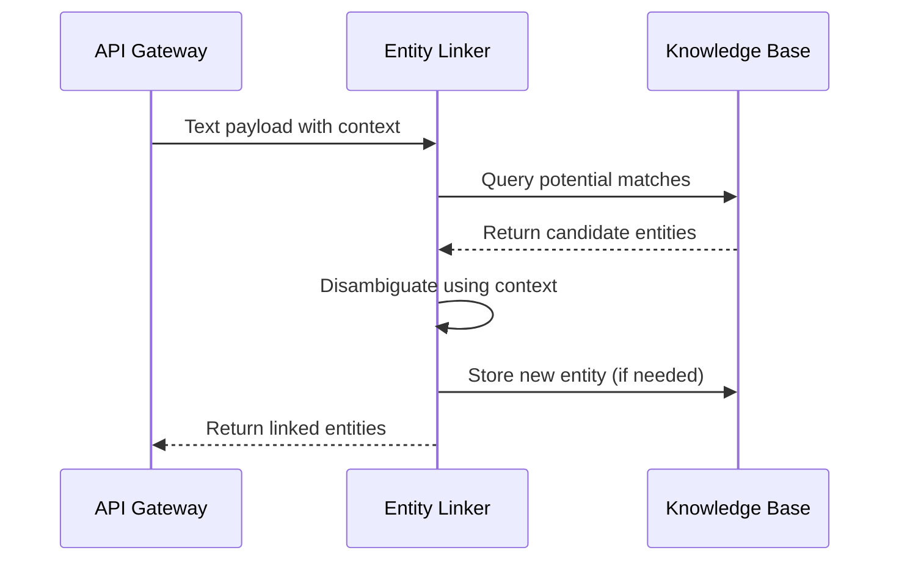

# 4.4 Entity Linking

## Overview
This story implements the entity linking functionality for the Heimdall Battery Sentinel system. Entity linking connects mentions of battery entities in unstructured text to structured knowledge bases.

## Functional Requirements
1. Extract battery-related entities from text data
2. Link entities to known batteries in our knowledge base
3. Handle ambiguous mentions using contextual disambiguation
4. Create new entity entries when novel batteries are detected

## Diagrams

### Entity Linking Workflow

### Data Flow

## Implementation Notes
- Use cosine similarity for entity matching
- Implement fallback strategy for low-confidence matches
- Log all resolution decisions for audit trail
- Threshold: min confidence = 0.85 for auto-linking

## Dependencies
- Knowledge Base Service (3.2)
- Text Processing Utilities (4.1)
- Similarity Scoring Service (4.3)