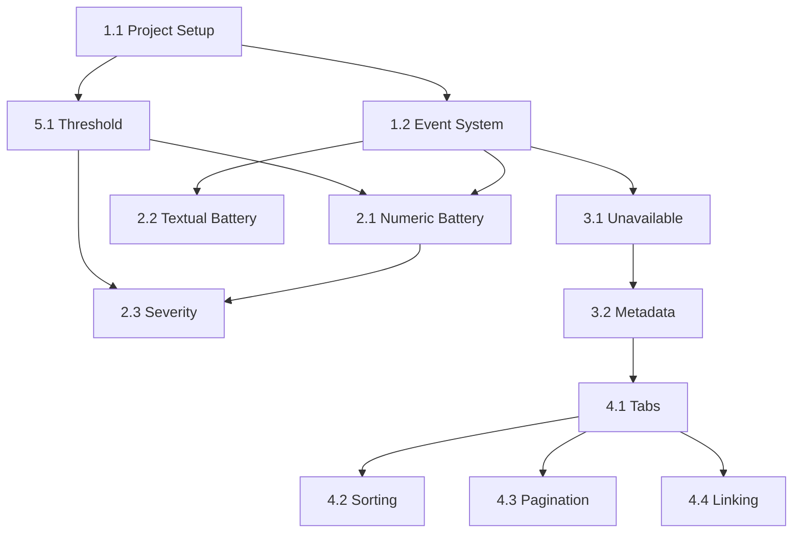

# Epics and Stories: Heimdall Battery Sentinel

## Overview

| Epic ID | Epic Name | Status | Stories |
|---------|-----------|--------|---------|
| 1 | Core Integration Setup | Backlog | 2 |
| 2 | Battery Monitoring | Backlog | 3 |
| 3 | Unavailable Tracking | Backlog | 2 |
| 4 | Frontend UI | Backlog | 4 |
| 5 | Configuration | Backlog | 1 |

## Epic 1: Core Integration Setup
**Description:** Foundation for HA integration

### Stories

#### 1.1: Project Structure Setup
**Description:** Initialize integration structure
**Size:** 1 day

**Acceptance Criteria:**
Given an empty HA custom_components directory,  
When the integration is installed,  
Then it should appear in HA with the domain `heimdall_battery_sentinel`,
And the structure should match the architecture document.

#### 1.2: Event Subscription System
**Description:** Setup event listeners
**Size:** 2 days

**Acceptance Criteria:**
Given HA is running,  
When a new entity is added or updated,  
Then the integration should detect the change within 5 seconds,
And update its internal state.

---

## Epic 2: Battery Monitoring
**Description:** Low battery detection and processing

### Stories

#### 2.1: Numeric Battery Evaluation
**Description:** Implement % battery rules
**Size:** 2 days

**Acceptance Criteria:**
Given a battery entity with unit_of_measurement="%",  
When its value is <= threshold,  
Then it should appear in the Low Battery dataset,
And be excluded if unit isn't "%".

#### 2.2: Textual Battery Handling
**Description:** Implement low/medium/high rules
**Size:** 1 day

**Acceptance Criteria:**
Given a battery entity with state "low",  
When the state updates,  
Then it should appear in the Low Battery dataset,
And show "low" in the UI.

#### 2.3: Severity Calculation
**Description:** Implement color/icon rules
**Size:** 2 days

**Acceptance Criteria:**
Given a numeric battery at 10% with threshold=15,  
When displayed in UI,  
Then it should show red color and high-severity icon,
And follow the ratio-based severity rules.

---

## Epic 3: Unavailable Tracking
**Description:** Monitoring unavailable entities

### Stories

#### 3.1: Unavailable Detection
**Description:** Track unavailable state
**Size:** 1 day

**Acceptance Criteria:**
Given any entity with state "unavailable",  
When it becomes unavailable,  
Then it should appear in the Unavailable dataset within 5 seconds.

#### 3.2: Metadata Enrichment
**Description:** Resolve device/area info
**Size:** 2 days

**Acceptance Criteria:**
Given an entity in either dataset,  
When displayed in UI,  
Then it should show manufacturer/model from device registry,
And area name from area registry.

---

## Epic 4: Frontend UI
**Description:** User interface implementation

### Stories

#### 4.1: Tabbed Interface
**Description:** Implement Low Battery/Unavailable tabs
**Size:** 2 days

**Acceptance Criteria:**
Given the panel is open,  
When viewing the interface,  
Then it should show two tabs with live counts that update in real-time,
And switch between them instantly with visual feedback.

#### 4.2: Sortable Tables
**Description:** Implement server-side sorting
**Size:** 3 days

**Acceptance Criteria:**
Given a table with 200+ entities,  
When clicking a column header,  
Then it should sort server-side,
And maintain tie-breaker by friendly name,
And the column header should show a visual indicator (▲/▼) for the sort direction.

#### 4.3: Infinite Scroll
**Description:** Implement paginated loading
**Size:** 2 days

**Acceptance Criteria:**
Given 150 low battery entities,  
When scrolling the table,  
Then it should load in 100-row chunks,
And show appropriate UI states:
  - Loading: Spinner with "Loading more entities..."
  - Empty: "No entities found" message
  - Error: "Failed to load" with retry button
  - End-of-list: "You've reached the end" indicator

#### 4.4: Entity Linking
**Description:** Add entity page links
**Size:** 1 day

**Acceptance Criteria:**
Given an entity in either table,  
When clicking its name,  
Then it should open the HA entity page in a new tab.

#### 4.5: Deployment
**Description:** Deploy integration to HACS and production
**Size:** 2 days

**Acceptance Criteria:**
Given the integration is complete,  
When deploying to production,  
Then it should be published to HACS (Home Assistant Community Store),
And include proper versioning (semver),
And have a proper release workflow with changelog.

---

## Epic 5: Configuration
**Description:** Threshold management

### Stories

#### 5.1: Threshold Setup
**Description:** Config flow implementation
**Size:** 2 days

**Acceptance Criteria:**
Given a new installation,  
When configuring the integration,  
Then it should show a slider from 5-100 with step=5,
With default value 15,
And the value should persist after restart,
And validate input to ensure it's within range.

---

## UX Traceability

| UX Element | Story IDs | Details |
|------------|-----------|---------|
| Tabs + live counts | 4.1 | Visible tab indicators with real-time entity counts |
| Sortable table headers | 4.2 | Interactive headers with ▲/▼ indicators for sort state |
| Infinite scroll UI states | 4.3 | Loading, empty, error, and end-of-list states |
| Entity linking | 4.4 | Navigation to HA entity detail pages |
| Threshold slider | 5.1 | Slider with step=5, range 5-100, persistent values |

## Requirement Traceability

| PRD Requirement | Story ID |
|-----------------|----------|
| FR-UI-001, FR-UI-002 | 1.1 |
| FR-UI-003, FR-UI-004 | 4.1 |
| FR-LB-001 to FR-LB-008 | 2.1, 2.2 |
| FR-SEV-001, FR-SEV-002 | 2.3 |
| FR-UNAV-001 to FR-UNAV-003 | 3.1 |
| FR-SORT-001 to FR-SORT-006 | 4.2 |
| FR-SCROLL-001 to FR-SCROLL-004 | 4.3 |
| FR-THR-001 to FR-THR-004 | 5.1 |
| FR-WS-001 to FR-WS-004 | 1.2 |
| FR-UI-005, FR-LB-003, FR-UNAV-003 | 4.4 |
| FR-LB-004 to FR-LB-006 | 2.1 |
| FR-LB-007, FR-LB-008 | 2.2 |

## Dependency Graph

