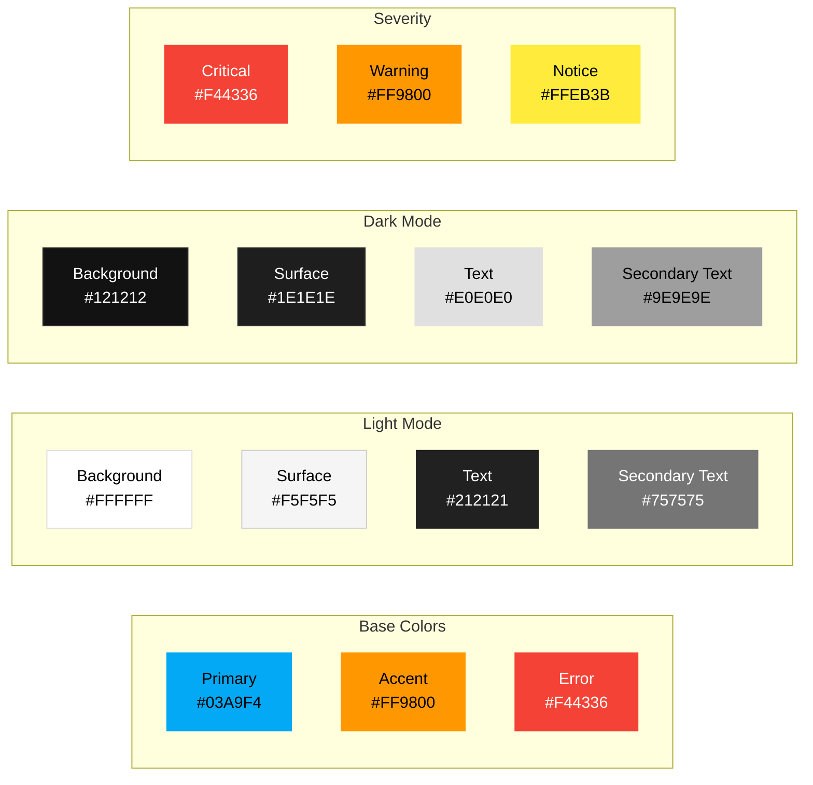
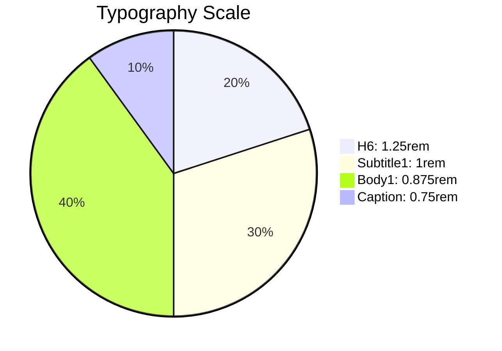
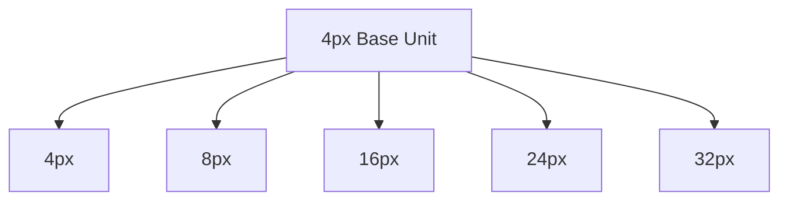
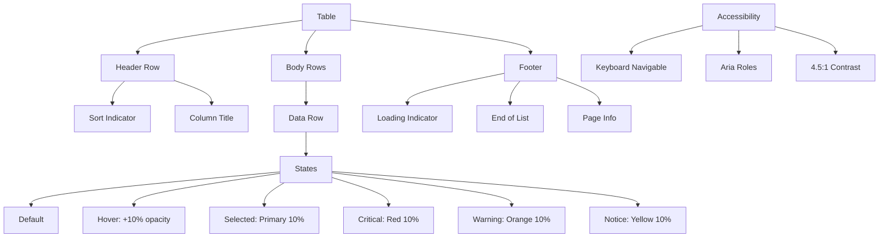
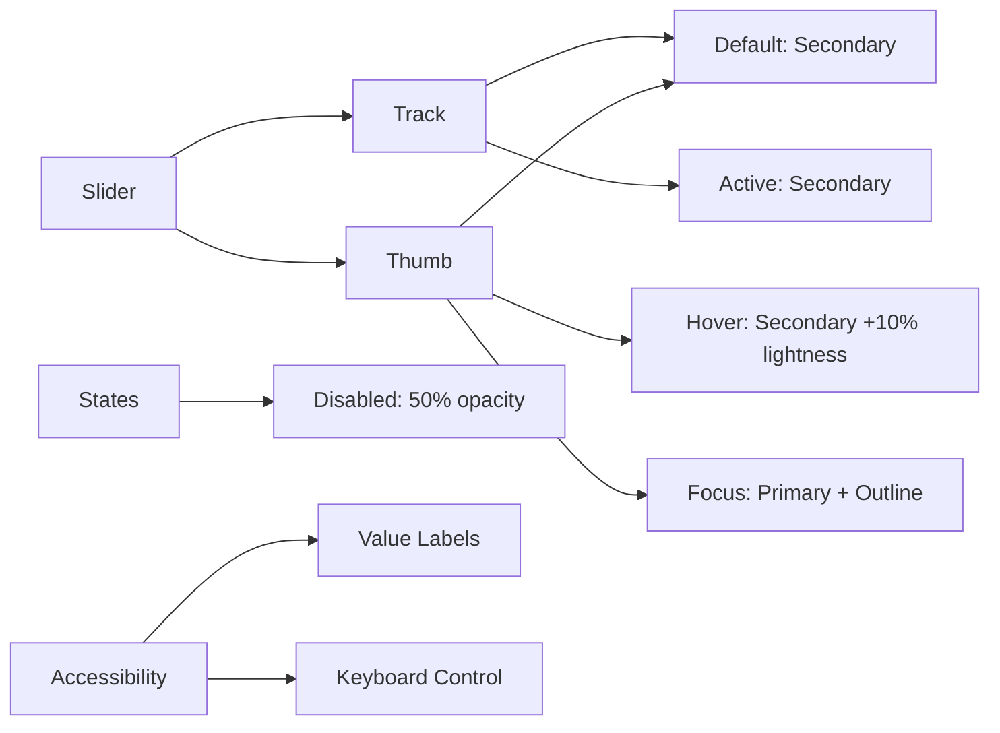
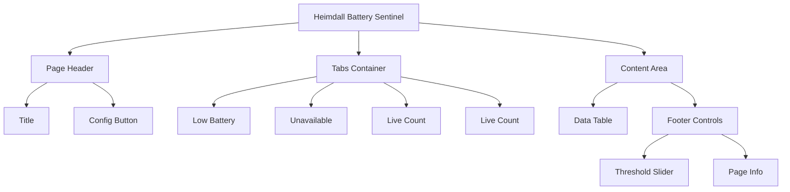
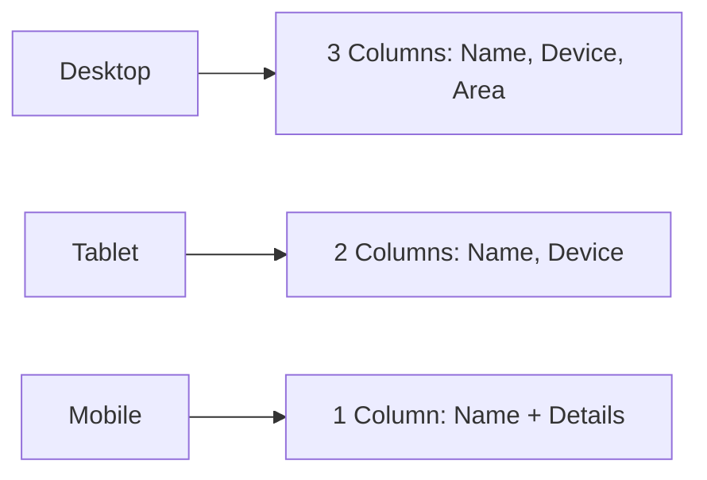
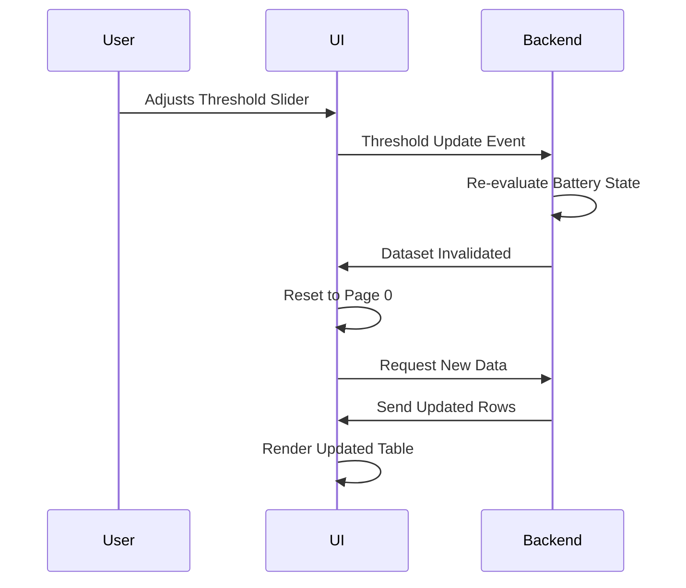
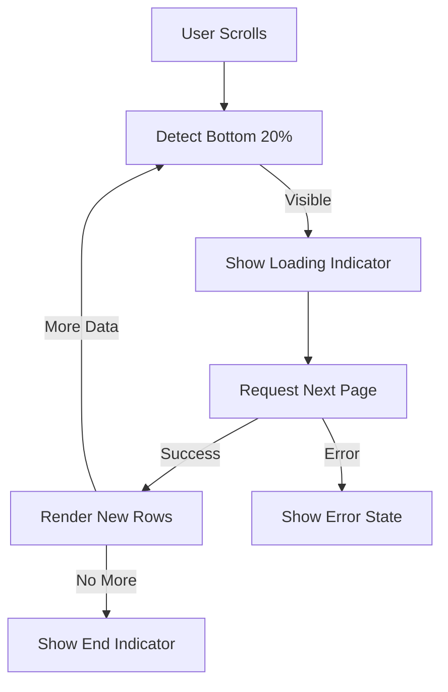

# UX Design Specification: Heimdall Battery Sentinel

## Design Principles

1. **Clarity First**: Prioritize clear information hierarchy to quickly identify critical issues (low batteries, unavailable entities)
2. **Native Integration**: Seamlessly match Home Assistant's Material Design aesthetic while adding distinctive battery-focused visual language
3. **Progressive Disclosure**: Show essential information first, with details available on interaction
4. **Responsive Resilience**: Ensure consistent experience across mobile, tablet, and desktop views
5. **Accessible by Default**: Meet or exceed WCAG 2.1 AA standards for all components

## Design Tokens

### Color Palette

### Typography Scale

### Spacing System

### Other Tokens
- Border Radii: 4px
- Shadows: 0 2px 4px rgba(0,0,0,0.1)
- Animation Timing: 200ms for micro-interactions, 300ms for transitions

## Component Library

### Table Component

### Threshold Slider

## Page Layouts

### Main Page Layout

### Responsive Behavior

## Interaction Patterns

### Threshold Change Flow

### Infinite Scroll

## Accessibility

- **Color Contrast**: Minimum 4.5:1 for text, 3:1 for UI components
- **Focus Management**: Visible focus indicators for all interactive elements
- **Screen Reader**:
  - ARIA roles for tables (grid, row, cell)
  - Live regions for count updates
  - Status announcements for loading states
- **Keyboard Navigation**:
  - Tab navigation between interactive elements
  - Arrow key navigation within tables
  - Space/Enter to activate controls
- **Reduced Motion**: Respect prefers-reduced-motion for animations
- **Dark Mode**: Full support for HA's dark theme
